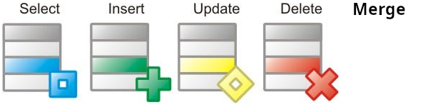

# `WITH`

- Common Table Expression (CTE).
- Auxiliary statements for use in a larger query.

  - Statement can be either

    

  - Increased readability.
  - Also enables us to use the result of a subquery in another sibling subquery, learn more [here](#how-in-psql-i-can-share-the-result-of-a-subquery-with-a-sibling-subquery).

- Think of it like it defines temporary tables that exist just for one query.
- Is attached to a primary statement that can also be a `SELECT`, `INSERT`, `UPDATE`, `DELETE`, or `MERGE`.
- Not only a syntax sugar but with `RECURSIVE` can do more than what you can do in SQL. Like using its own results in each iteration.
- Another useful property of `WITH` is the fact that they are normally evaluated only once per execution of the parent query.

  Even if you refer to them more than once inside the parent query or sibling `WITH` queries. Thus, expensive calculations that are needed in multiple places can be placed within a `WITH` query.

  1. A better performance.
  2. If your subquery has side effects this way you can prevent it.

- `NOT MATERIALIZED` can help you to prevent PostgreSQL from creating a temporary table for the subquery.

## How in PSQL I can share the result of a subquery with a sibling subquery?

Of course by using `WITH` clause ;). You can reference the result of a subquery in other sibling subqueries like this:

```sql
WITH messages AS (
  SELECT *
  FROM public.messages
  WHERE sender_id = '754cf10b-d3a3-4851-af9a-11ad51dc8357'
        AND receiver_id = 'b9e0c6b9-4c7f-441f-b6cc-1cf6521c141b'
        -- But if user is request the very first page we are not gonna add this condition
        -- AND (created_at, id) < (previous_created_at, previous_id)
  ORDER BY created_at DESC, id DESC
  LIMIT 10
), last_message AS (
  SELECT *
  FROM messages
  -- Note how we are reversing our sorting here to get the last message!
  ORDER BY created_at ASC, id ASC
  -- Through LIMIT clause we're retrieving the last message.
  LIMIT 1
), next_page_count AS (
  SELECT count.count
  --
  --  !!!!!! BUGGY !!!!!!
  --
  -- This part is buggy. Look at this for a bug free version: https://github.com/kasir-barati/react/blob/417d147f19ea3918bf443f33aafbd2045c898326/apps/api/src/repositories/message.repository.ts#L26-L66
  --
  -- Since the subquery can return more that one row thanks to GROUP BY. So my intentions was to count all rows and not each group (BTW grouping is not the issue here, I mean it is fine that we have several rows). So I had to get rid of GROUP BY but I needed to keep the ORDER BY. So what we can do is to extract all ids in a separate CTE and count it next.
  --
  -- Error message: "Raw query failed. Code: `21000`. Message: `ERROR: more than one row returned by a subquery used as an expression`"
  --
  FROM (SELECT COUNT(public.messages.id), public.messages.created_at
        -- Notice that we have joined these two tables in order to be able to calculate whether there is anything else that user might wanna fetch in their next request.
        FROM public.messages, last_message
        WHERE public.messages.sender_id = '754cf10b-d3a3-4851-af9a-11ad51dc8357'
              AND public.messages.receiver_id = 'b9e0c6b9-4c7f-441f-b6cc-1cf6521c141b'
              AND (public.messages.created_at, public.messages.id) < (last_message.created_at, last_message.id)
        -- Since we needed to sort them first and we where using an aggregate function we had to do a GROUP BY.
        GROUP BY public.messages.created_at, public.messages.id
        ORDER BY public.messages.created_at DESC, public.messages.id DESC
        LIMIT 10
       ) AS count
)
SELECT
  -- Here we'll aggregate all messages under a single column called data.
  (SELECT JSONB_AGG(TO_JSONB(messages))
   FROM (SELECT *
         FROM messages
        ) as messages
  ) AS data
  -- Now in our app we can determine whether there will be a next page;
  -- I.e. if the "count" is null then we know that there won't be a next page.
  -- Otherwise there will be at least one.
  -- And as for the next page's query string they just need to send the last message's created_at and id as cursor. You can take care of that in your backend too.
  (SELECT *
   FROM next_page_count
  ) AS count
;
```

Here we optimized and improved the readability of our SQL query by a ton. [Here](https://github.com/kasir-barati/react/blob/417d147f19ea3918bf443f33aafbd2045c898326/apps/api/src/repositories/message.repository.ts#L26-L66) you can see how it is done in Prisma.

## Ref

- https://www.postgresql.org/docs/current/queries-with.html
