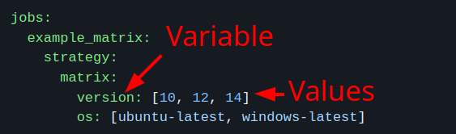

# CI pipeline

- Boost productive.
- Improve overall code quality.
- Achieving faster deployments.
- Commit early, commit often:
  - It’s much easier to fix small problems than big problems.
  - Bugs are easier to identify because there is less code to sort through.
- Document your CI, create FAQs, and link these docs wherever needed.
- KISS:
  - No complex build process.
  - Every minute taken off build times is a minute saved for each developer every time they commit.
- Use failures to improve processes:
  - **Instead of** asking **who** caused the failure, **ask what** caused the failure.
  - Shift from a blaming culture to a learning culture.
- Similar env for both production and test.
- Since we wanna have a faster GitHub workflow we need husky to define very tedious, non-rewarding tasks as git hooks in order to prevent failing GitHub actions for reasons such as prettier.

\- [Ref](https://about.gitlab.com/topics/ci-cd/continuous-integration-best-practices/)

> [!TIP]
>
> [How to use docker compose in CI](https://stackoverflow.com/q/29568352/8784518).

# `name`

- The name of the workflow.
- Displayed as the names of your workflows under your repository's "Actions" tab.
- If omitted, GitHub displays the workflow file path.

# `on`

- Automatically triggers a workflow.
- Trigger a workflow when:
  - A single or multiple events occurred.
  - A time schedule was fulfilled.
- Restrict the execution of a workflow to only occur for specific:
  - Files.
  - Tags.
  - Branch changes.

## `on.workflow_run`

- Specify what branches the triggering workflow must run on in order to trigger this workflow.

### `on.workflow_run.branches`

- Accept glob patterns: `*`, `+`, `**`, `?` + `!`.

## `on.workflow_dispatch`

- Optionally specify inputs that are passed to the workflow.
- Receives events when the workflow file is on the default branch.

### `on.workflow_dispatch.inputs`

- Preserves Boolean values as Booleans instead of converting them to strings.
- Maximum number of top-level properties: 10.
- Maximum payload for inputs: 65,535 characters.

#### `on.workflow_dispatch.inputs.input_ID.description`

- I did not find it [here](https://docs.github.com/en/actions/writing-workflows/workflow-syntax-for-github-actions#onworkflow_dispatchinputs). Thus I am not sure if this is a standard one.
- But its name is self explanatory. It describes the input.

#### `on.workflow_dispatch.inputs.input_ID.required`

- A boolean specifying whether the input must be supplied.

#### `on.workflow_dispatch.inputs.input_ID.type`

- A string specifying the data type of the input.
- Options: `boolean`, `choice`, `number`, `environment` or `string`.

# `env`

- A map.
- Available variables for steps of all jobs in the workflow.
- Specificity: an environment variable defined in a step will override job and workflow environment variables with the same name, while the step executes.

# `jobs`

- They run in parallel by default.
- To run jobs sequentially, you can define dependencies on other jobs using the `jobs.job_ID.needs`.
- Runs in a runner environment specified by `runs-on`.

## `jobs.job_ID`

- A unique identifier: `jobs.job_ID`.
- A string.
- A map of the job's configuration data.
- Must start with a letter or `_`.
- Contains only alphanumeric characters, `-`, or `_`.

### `jobs.job_ID.runs-on`

- Defines the type of machine to run the job on.
- Options:
  - Larger runner.
  - Self-hosted runner.
  - [GitHub-hosted runner](https://docs.github.com/en/actions/writing-workflows/workflow-syntax-for-github-actions#standard-github-hosted-runners-for-public-repositories).
- Provide `runs-on` as:
  - A single string, e.g. `runs-on: ubuntu-22.04`
  - A single variable containing a string.
  - An array of strings, e.g. `runs-on: [self-hosted, linux, x64, gpu]`.
  - An array of variables containing strings.
  - An array of strings and variables, e.g. `runs-on: [self-hosted, "${{ inputs.chosen-os }}"]`.
  - A `key-value` pair.

### `jobs.job_ID.timeout-minutes`

- For how long a job run before GitHub automatically cancels it.
- Default: 360 minutes.
- `GITHUB_TOKEN` expires when a job finishes or after 24 hours. For self-hosted runners, the token may be the limiting factor if the job timeout is greater than 24 hours.

### `jobs.job_ID.if`

- Prevent a job from running unless a condition is met.
- Is evaluated before `jobs.job_ID.strategy.matrix` is applied. Meaning we cannot define condition here as to prevent the job from being executed for a specific matrix. We need to do it probably at the steps level.
- E.g. `if: github.repository == 'octo-org/octo-repo-prod'`

### `jobs.job_ID.strategy`

- Use variables in a single job definition to automatically create multiple job runs that are based on the combinations of the variables.
- E.g. use a matrix strategy to test your code in multiple versions of a language or on multiple operating systems.

#### `jobs.job_ID.strategy.matrix`

- Define one or more variables followed by an array of values.



### `jobs.job_ID.steps`

### `jobs.job_ID.steps[*].uses`

- A reusable unit of code.
- Use:
  - A public repository.
  - A published Docker container image.
  - An action defined in the same repository as the workflow.
    - Actions are either:
      - JavaScript files.
      - Docker containers.
    - ```cmd
      |-- hello-world (your repository)
      |   |__ .github
      |       └── workflows
      |           └── my-first-workflow.yml
      |       └── actions
      |           |__ hello-world-action
      |               └── action.yml
      ```
- **Specify the version**.

### `jobs.job_ID.steps[*].run`

- Runs command-line programs.
- No longer than 21,000 characters.
- Uses the operating system's shell.
- Non-login shells by default.
- A new process and shell in the runner environment.
- Multi-line commands run in the same shell.

# Secrets

- Store sensitive information in your:
  - Organization.
  - Repository.
  - Repository environments.

## [`GITHUB_TOKEN`](https://docs.github.com/en/actions/security-for-github-actions/security-guides/automatic-token-authentication1)

- At the **start of each workflow job**, GitHub automatically creates a unique `GITHUB_TOKEN` secret to use in your workflow.
- Use the `GITHUB_TOKEN` to authenticate in the workflow job.

# `github` context

- Information about the workflow run and the event that triggered the run.
- It contains `github.token`.
- `github.server_url`: The URL of the GitHub server. E.g. "https://github.com".
- `github.repository`: The owner and repository name. E.g. "octocat/Hello-World".
- `github.run_id`:
  - A unique number for each workflow run within a repository.
  - This number **does NOT** change if you re-run the workflow run.

# Expressions

- An expression can be any combination of literal values, references to a context, or functions.
- Commonly used with the conditional `if` keyword in a workflow file to determine whether a step should run.
- `${{ <expression> }}`
  - In an `if` clause, where, optionally, you can usually omit `${{` and `}}`.

## Status check function - `success()`

- Returns `true` when **all** previous steps have succeeded.
