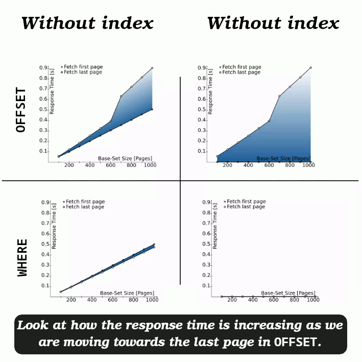

# Pagination

## `OFFSET` implementation

- `OFFSET` instructs the database to skip the first N results of a query.
- When we do **NOT** specify it it is equal to 0;

- We have a table called "news_articles".

  | column name  | type        |
  | ------------ | ----------- |
  | `id`         | `uuid`      |
  | `title`      | `Timestamp` |
  | `created_at` | `Timestamp` |
  | `updated_at` | `Timestamp` |

- We wanna fetch part of the store data according to the `WHERE` clause, `OFFSET`, and `LIMIT`.

### Breaking the problem into two half

1. How can I do it in two separate queries (super simple).
2. How can I combine them into one query, I do not like the sound of a two I/O whereas I can do it in one.

#### Separate queries

- Selecting data:

  ```sql
  SELECT *
  FROM public.news_articles
  WHERE title LIKE '%something%'
  ORDER BY created_at ASC
  OFFSET 0
  LIMIT 10;
  ```

  > [!CAUTION]
  >
  > - It is important to add `OFFSET` and `LIMIT` after everything else. Otherwise your query will fail when you execute it.
  > - Do not omit `ORDER BY` when you have used `LIMIT` if you want to be able to predict what subset of data you're gonna receive.
  >
  >   Query optimizer takes `LIMIT` into account when generating query plans, so you are very likely to get different plans (yielding different row orders) depending on what you give for `LIMIT` and `OFFSET`.
  >
  >   Using different `LIMIT`/`OFFSET` values to select different subsets will give inconsistent results unless you enforce a predictable result ordering with `ORDER BY`.
  >
  >   **This is not a bug**; it is an inherent consequence of the fact that **SQL does not promise to deliver the results of a query in any particular order unless `ORDER BY` is used**.
  >
  > &mdash; [Ref](https://www.postgresql.org/docs/current/queries-limit.html).

- Counting all the records, so that we can calculate next page and previous page number if any:

  ```sql
  SELECT COUNT(id) as "total"
  FROM public.news_articles;
  ```

  Here we are using `COUNT(id)` so that we are sure we are counting all the records. As you know this aggregate function won't count null values. Thus `id` is the best choice.
  &mdash; [Ref](https://www.postgresql.org/docs/8.2/functions-aggregate.html)

- And then we can just calculate the previous page and next page like this:

  ```sql
  SELECT total / 10::double precision AS "totalPage";
  ```

  Then if `totalPage` is bigger than the current page (`(limit + offset) / limit`)

  - I just increase the page by one and previous page will be the current page.
  - Otherwise there is not next page. But our previous page would be the current page minus one.

  [Learn more about casting](https://www.postgresql.org/docs/current/sql-createcast.html). In this example we: - Invoked a cast through its `construct`: i.e. `10::double precision`. - But we could do it also explicitly: i.e. `CAST(10 AS double precision)`.

#### Smashing and combining all of these

- **Nested queries**: For that to happen we need to write a **subquery** within our main query. So that we can get everything in one fell swoop.

  Read about more [here](https://www.postgresql.org/docs/17/queries-table-expressions.html#QUERIES-SUBQUERIES), and I could not find something more elaborate. Dunno if they missed it or simply I was not able to find the doc related to subqueries. But most likely it is scattered in their website.

- We also need to utilize some of the builtin functions of PSQL:
  - `TO_JSONB` converts all columns of "news_articles" into a jsonb or json datatype ([ref](https://www.postgresql.org/docs/9.5/functions-json.html)).
    - Alternatively we can use `JSONB_BUILD_OBJECT` where we should alternating keys and values.
  - `JSON_AGG` to aggregating json data ([ref](https://www.postgresql.org/docs/9.5/functions-aggregate.html)).

```sql
SELECT *, (total / 10::double precision)::int AS "totalPage"
FROM (
  SELECT
    (SELECT COUNT(id) FROM public.news_articles) AS "total",
    (
      SELECT JSON_AGG(TO_JSONB(filtered_news_articles))
      FROM (
	    	SELECT *
		    FROM public.news_articles
		    WHERE title LIKE '%something%'
            ORDER BY created_at ASC
	    	OFFSET 0
	    	LIMIT 10
	    ) as "filtered_news_articles"
	  ) AS "data"
);
```

This query will return something like this if you wanted to see it in plain JSON:

```js
{
  "total": 50,
  "data": [
    {
      "id": "9b050c4f-e0dc-4c19-9e02-844957a67522",
      "title": "A title with something inside it!"
      // ...
    },
    {
      "id": "b5c5c3c9-75c9-4495-908f-47e42abc92a9",
      "title": "Is something ready?"
      // ...
    },
    // ...
  ],
  "totalPage": 5
}
```

> [!IMPORTANT]
>
> - In a real world app we usually tend to use dynamic values for `limit` & `offset`. That's why I used a cast operator to convert limit into double precision. Otherwise it would performed an integer operation and that could lead to not seeing last page's data.
> - Here we are converting the `totalPage` back to `int` again after it is calculated.
> - Calculating everything in SQL can become cumbersome if you over do it. Just look at how much harder it is to read it just because we wanted to have the `totalPage` calculate inside SQL. But instead we could do it in our codebase.

### Why you should not probably use `OFFSET` for pagination

1. The database fetches rows from the disk. Then it drop part of it and return the rest.
2. `OFFSET` takes only one single parameter, thus big `OFFSET`s impose a lot of work on the database.
3. If a new rows were to be inserted in between two separate request you might get duplicate data.

   

   > [!CAUTION]
   >
   > The part that is also contributing in this behavior is where we are sorting based on age since kasir in this case might end up higher in the fetched records, thus leading to this buggy behavior.
   >
   > But here we are sorting news based on `created_at`. So this situation won't happen.

The root cause of this issue lies in the fact that we are only telling database how many records should be dropped. No more. And, well this is not very much context.

Thus after seeing how we can implement it with OFFSET we're gonna discuss a [better option](#where-implementation).

- We are working on a sorted data set (`ORDER BY...`).
- We'll ask database to only returns from the point that we've seen last time:

  ```sql
  SELECT * FROM users
  WHERE id < ?last_seen_id # parameter placeholder
  ORDER BY id DESC
  FETCH FIRST 10 ROWS ONLY
  ```

  > [!NOTE]
  >
  > AKA _seek method_ or _keyset pagination_.

- You can add more condition to the `WHERE` clause if you need.
- Applicable to both SQL and NoSQL.

### Benchmark

- Note that `topic` is indexed in the following query; i.e

  ```sql
  CREATE INDEX news_articles_topic_index
  ON news_articles(topic);
  ```

#### `OFFSET 0`


Here we're:

1. Bitmap index/heap scan: database engine scans the rows using a bitmap index scan based on the `WHERE` clause <small>(what we have now is an unsorted result)</small>.
2. Sorting results by:

   - `published_at` in descending order (those published will be returned first)
   - Then by `id` in descending order if there are ties.

   "top-N heapsort" is used since we only want a couple of sorted rows (learn more about it [here](https://www.cybertec-postgresql.com/en/postgresql-improving-sort-performance/)).

   > [!NOTE]
   >
   > BTW when I tried this query in my local system it was using quicksort algorithm and not top-N, :confused:.

   Learn more about this topic [here](https://pganalyze.com/blog/5mins-postgres-planner-order-by-limit).

3. We are returning only the amount specified in the `LIMIT` clause.

#### `OFFSET 10`


- As you can see here we are now using a little more memory. But this amount increases as we go further backward. To the extend that PostgreSQL uses disk to sort things and limit them since they exceed the defined value for `work_mem`.

  You can see what is the defined value in your database by running `SHOW work_mem;`. In my case it was 4MB.

  Thus when we reach a point that it can no longer sort data in memory it will turn to disk.

#### `OFFSET 40`


As you can see the bigger the dataset we have after `WHERE` clause the more time it takes.

#### Conclusion for these different `OFFSET`s

**Pay attention to the shaded area between the two lines to see the differences between the two series.**


- As our dataset (fetched data) grows our response time also increases.
- Fetching first page is not the same as fetching last page.
- We can improve this by indexing the `published_at` field.

  

  As you can see, fetching the first pages is snappy, but response time increases as you go further back.

- But there is a better solution to this issue and that is using a ["seek method"](#where-implementation).

## `WHERE` implementation

Here we are first starting without indexing `published_at` field.

```sql
SELECT * FROM public.news_articles
WHERE
  topic = 'huawei'
	AND (
    published_at,
    id
  ) < (
    previous_published_at,
    previous_id
  )
ORDER BY published_at DESC, id DESC
LIMIT 10;
```

- A definite sort order is mandatory.
- The second part of the `WHERE` clause is a [tuple comparison](../glossary.md#tupleComparison).


Since we are no longer fetching lots of data just to sort (`ORDER BY`) and then skip (`OFFSET` and `LIMIT`) we have:

- Low response time.
- Low memory footprint.


> [!TIP]
>
> If we index the `published_at` too then we are gonna have a much lower response time.

## Seek method VS `OFFSET`



There are a couple of limitations that seek method has:

- User cannot navigate to an arbitrary page (needs values from previous page). This is not a problem if you have infinite scroll. Something like [this](https://github.com/kasir-barati/react/blob/9cd69d1739377bca30e6222e1458bc7425595feb/apps/react/src/components/post/InfiniteScrollFeed.component.tsx) in your ReactJS app.
- To go backward (like scrolling upward in your ReactJS app) you need to:
  1. Reverse the tuple comparison:
     ```sql
     # ...
     AND (
       published_at,
       id
     ) >
     (
       previous_published_at,
       previous_id
     )
     # ...
     ```
  2. Sort ascending:
     ```sql
     # ...
     ORDER BY published_at ASC, id ASC
     # ...
     ```
- PostgreSQL has the best support for it.

### References

- [Ref1](https://use-the-index-luke.com/no-offset).

### Learn more

- https://ddnexus.github.io/pagy/docs/api/keyset.
- https://www.cybertec-postgresql.com/en/keyset-pagination-with-descending-order.
