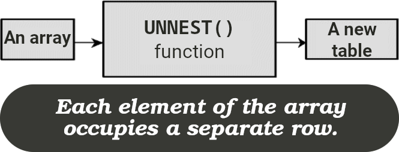

# [`unnest` -- Array Function](https://www.postgresql.org/docs/9.2/functions-array.html)



- Expand an array to a set of rows.
- Combine it with `array_agg`, `array_length`, `array_remove`, `string_to_array`, and `jsonb_array_elements_text`.

## Good for

Normalizing denormalized data, where each array element needs to be processed individually.

- Break down array data into individual elements for detailed analysis.
- Filter & aggregate specific elements within arrays.

## Considerations

- Performance wise:
  - Unnesting very large arrays can be resource-intensive.
  - Optimize your query before combining it with `unnest`.
- Might not handle custom types correctly.

## Example -- Bulk create

```sql
INSERT INTO users(id, name)
SELECT *
FROM unnest(
  $1::uuid[],
  $2::text[]
) a(id, name)
```

- **Just a reminder**: [Insert can work with the result of another `SELECT` query](../README.md#insertReturnedResultOfSubquery).
- You can find a more sophisticated example [here](https://github.com/kasir-barati/nestjs-materials/blob/6b04914b38fbdb3d0398cd6e26a65f7868ab276b/typeorm/apps/botprobe-nest/src/seeds/alert.seed.ts).

> [!NOTE]
>
> The simplified version of the nested `SELECT` query:
>
> ![SELECT * FROM unnest(Array[1, 2], Array['はると', 'Kasir']) a(id, name)](../assets/unnest-nested-query-demonstration.png)
